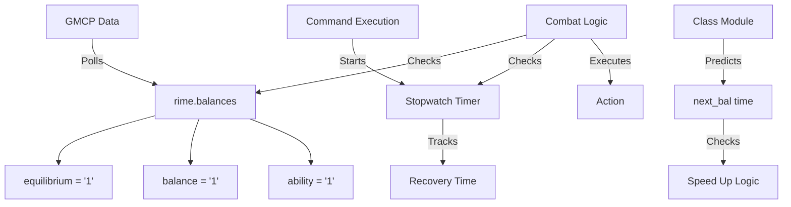
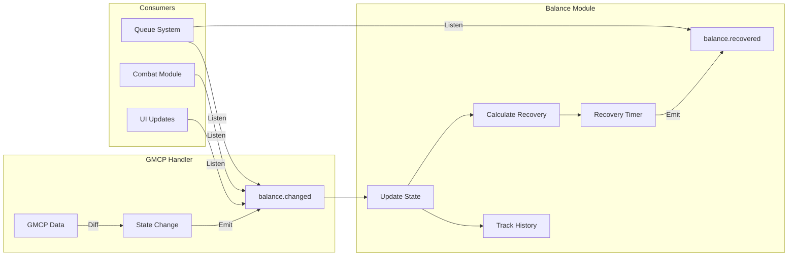
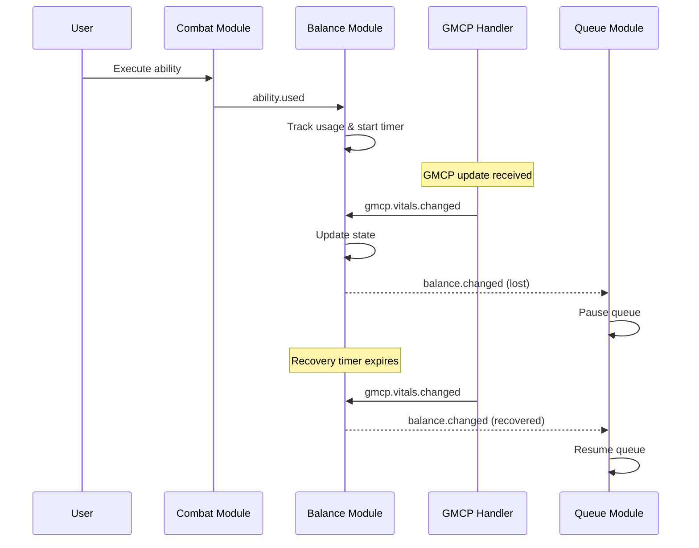

# Rime Balance & Equilibrium Tracking Analysis

## Overview

Rime tracks balance and equilibrium through a combination of GMCP data polling and timing mechanisms. This document analyzes their implementation and proposes improvements for EMERGE.

## How Rime Tracks Balance/Equilibrium

### 1. GMCP-Based State Tracking

Rime polls GMCP data to maintain balance state:

```lua
-- From Rime GMCP.lua
rime.balances.equilibrium = gmcp.Char.Vitals.equilibrium == "1"
rime.balances.balance = gmcp.Char.Vitals.balance == "1"
rime.balances.ability = gmcp.Char.Vitals.ability_bal == "1"
rime.balances.pill = gmcp.Char.Vitals.herb == "1"
rime.balances.poultice = gmcp.Char.Vitals.salve == "1"
```

**Problems:**
- Direct GMCP polling on every update
- String comparison for boolean values
- No event emission for state changes
- No differential tracking

### 2. Timing System

Rime uses stopwatches to track recovery times:

```lua
function rime.time(thing, player, limit)
    if player then
        -- Track timers per player
        rime.targets[player].time[thing] = createStopWatch()
        resetStopWatch(rime.targets[player].time[thing])
        startStopWatch(rime.targets[player].time[thing])
    else
        -- Track own timers
        rime.stopwatch[thing] = createStopWatch()
        resetStopWatch(rime.stopwatch[thing])
        startStopWatch(rime.stopwatch[thing])
    end
end
```

### 3. Recovery Prediction

Classes track their own balance usage:

```lua
-- From Archivist
archivist.next_bal = getEpoch() + cost

function archivist.speedup()
    if archivist.next_bal - getEpoch() > 1 then
        if not rime.balances.equilibrium then
            act("bio stimulant")
        elseif not rime.balances.balance then
            act("bio steroid")
        end
    end
end
```

## Architectural Flow Diagram



## Problems with Rime's Approach

### 1. **No Event-Driven Updates**
Balance changes are checked by polling, not events:
```lua
-- Bad: Constant checking
if rime.balances.balance and rime.balances.equilibrium then
    rime.pvp.queue_handle()
end
```

### 2. **String Comparisons**
```lua
-- Inefficient string comparison
rime.balances.equilibrium = gmcp.Char.Vitals.equilibrium == "1"
```

### 3. **Manual Timer Management**
Each class manually tracks recovery times without centralization.

### 4. **No State History**
No tracking of when balance was lost or recovered.

### 5. **Fragmented Logic**
Balance checking scattered throughout codebase.

## EMERGE's Event-Driven Balance System

### Design Philosophy

1. **Event-Driven Updates** - Balance changes emit events
2. **Centralized Tracking** - Single source of truth
3. **Predictive Recovery** - Calculate expected recovery times
4. **Historical Tracking** - Know when/why balance was lost
5. **Modular Integration** - Clean API for all modules

### Proposed Architecture



### Implementation Structure

```lua
-- modules/balance.lua
emerge.balance = {}
local module = emerge.balance

-- State tracking
local state = {
    equilibrium = true,
    balance = true,
    ability = true,
    herb = true,
    salve = true,
    writhe = true,
    focus = true
}

-- Recovery tracking
local recovery = {
    equilibrium = {
        lost_at = 0,
        expected_recovery = 0,
        actual_recovery = 0,
        reason = ""
    }
    -- ... other balances
}

-- History tracking
local history = {}

function module.init()
    -- Listen for GMCP changes
    emerge.events:on("gmcp.vitals.changed", handle_gmcp_update)
    
    -- Listen for ability usage
    emerge.events:on("ability.used", handle_ability_used)
    
    -- Listen for afflictions that affect balance
    emerge.events:on("affliction.gained", handle_affliction)
end

function handle_gmcp_update(data)
    -- Check for balance changes
    for balance_type, value in pairs(data) do
        local old_state = state[balance_type]
        local new_state = (value == "1")
        
        if old_state ~= new_state then
            -- State changed, emit event
            emerge.events:emit("balance.changed", {
                type = balance_type,
                has_balance = new_state,
                lost_at = not new_state and getEpoch() or nil,
                recovered_at = new_state and getEpoch() or nil,
                recovery_time = calculate_recovery_time(balance_type)
            })
            
            -- Update state
            state[balance_type] = new_state
            
            -- Track history
            track_history(balance_type, new_state)
        end
    end
end

function handle_ability_used(ability_data)
    -- Track which ability consumed balance
    if ability_data.consumes then
        for _, balance_type in ipairs(ability_data.consumes) do
            recovery[balance_type].reason = ability_data.name
            recovery[balance_type].expected_recovery = 
                getEpoch() + ability_data.recovery_time
            
            -- Start recovery timer
            start_recovery_timer(balance_type, ability_data.recovery_time)
        end
    end
end

function start_recovery_timer(balance_type, duration)
    tempTimer(duration, function()
        if not state[balance_type] then
            -- Balance hasn't recovered yet, something's wrong
            emerge.events:emit("balance.recovery.delayed", {
                type = balance_type,
                expected = recovery[balance_type].expected_recovery,
                actual = getEpoch()
            })
        end
    end)
end

-- Public API
function module.has(balance_type)
    return state[balance_type] or false
end

function module.all()
    return state.equilibrium and state.balance
end

function module.get_recovery_time(balance_type)
    if state[balance_type] then return 0 end
    
    local expected = recovery[balance_type].expected_recovery
    local now = getEpoch()
    
    return math.max(0, expected - now)
end

function module.get_history(balance_type, count)
    -- Return last N balance changes
    return history[balance_type] or {}
end
```

### Event Flow Example



## Key Improvements Over Rime

### 1. **Event-Driven Architecture**
```lua
-- EMERGE approach
emerge.events:on("balance.changed", function(data)
    if data.has_balance then
        -- Resume actions
    else
        -- Pause actions
    end
end)
```

### 2. **Centralized State Management**
```lua
-- Single source of truth
if emerge.balance.has("equilibrium") then
    -- Act
end
```

### 3. **Predictive Recovery**
```lua
-- Know when balance will return
local recovery_in = emerge.balance.get_recovery_time("equilibrium")
emerge.events:emit("show.timer", {
    name = "Equilibrium",
    duration = recovery_in
})
```

### 4. **Historical Tracking**
```lua
-- Analyze patterns
local history = emerge.balance.get_history("equilibrium", 10)
for _, change in ipairs(history) do
    print(string.format("%s: %s at %s", 
        change.type, 
        change.has_balance and "recovered" or "lost",
        change.timestamp
    ))
end
```

### 5. **Affliction Integration**
```lua
-- Automatic balance modification from afflictions
emerge.events:on("affliction.gained", function(aff)
    if aff == "stupidity" then
        emerge.balance.modify_recovery("equilibrium", 0.5) -- 50% longer
    end
end)
```

## Implementation Priority

1. **Phase 2.1**: Core balance tracking module
2. **Phase 2.2**: GMCP differential updates
3. **Phase 2.3**: Recovery prediction system
4. **Phase 2.4**: Integration with combat modules
5. **Phase 2.5**: Advanced features (history, analytics)

## Legacy System Analysis

### How Legacy Tracks Balance

Legacy uses a simpler approach than Rime:

```lua
-- From Legacy init
Legacy.Curing.bal = {
    tree = true,
    eat  = true,
    sip  = true,
    apply = true,
    focus = true,
    active = true,
    smoke = true,
}
```

**Balance Checking in Prompt:**
```lua
-- Direct GMCP polling in prompt display
if gmcp.Char.Vitals.eq == "1" then
    cecho("<red>e")
end
if gmcp.Char.Vitals.bal == "1" then
    cecho("<red>x")
end
```

**Key Differences from Rime:**
1. **Simpler Structure** - Just boolean flags for each balance type
2. **No Timing** - No stopwatch or recovery prediction
3. **Manual Tracking** - Balances set via triggers (e.g., dragonheal)
4. **Prompt-Based** - Updates only when prompt is displayed
5. **No Events** - Direct variable checking

### Legacy's Limitations

1. **No GMCP Event Handling** - Relies on prompt updates
2. **Trigger-Based Updates** - Manual balance tracking via triggers:
   ```lua
   -- Dragonheal trigger
   Legacy.Curing.bal.active = false
   -- Recovery trigger  
   Legacy.Curing.bal.active = true
   ```
3. **No Recovery Prediction** - Can't estimate when balance returns
4. **No History** - No tracking of balance usage patterns
5. **Scattered Logic** - Balance checks throughout codebase

## Comparison Summary

| Feature | Legacy | Rime | EMERGE |
|---------|--------|------|---------|
| **Architecture** | Direct variables | Stopwatch timers | Event-driven |
| **GMCP Handling** | Prompt polling | Direct polling | Differential events |
| **Recovery Tracking** | None | Manual timers | Automatic prediction |
| **State History** | None | None | Full history |
| **Module Integration** | Direct access | Direct access | Event listeners |
| **Performance** | Poor (prompt only) | Medium (polling) | High (events) |

## Conclusion

Both Legacy and Rime suffer from similar architectural problems:
- **Tight coupling** - Modules directly check balance states
- **No event system** - Polling-based updates
- **Manual management** - Each system manually tracks its own state
- **Limited debugging** - No history or analytics

EMERGE's event-driven approach solves all these issues:
- **Loose coupling** through events
- **Centralized management** with single source of truth
- **Automatic tracking** with predictive recovery
- **Rich debugging** with full history and analytics
- **Better performance** through differential updates

This design allows modules to focus on their logic rather than balance management, leading to cleaner, more maintainable code.