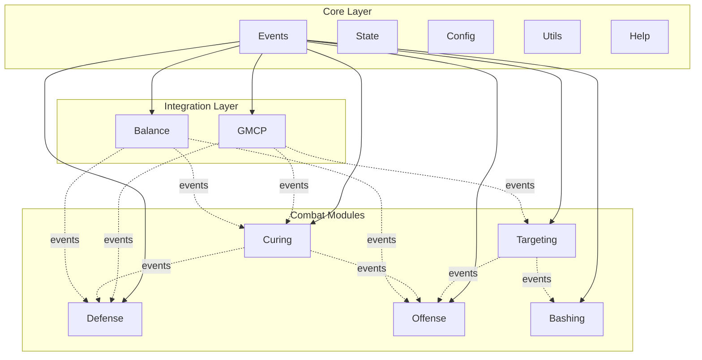
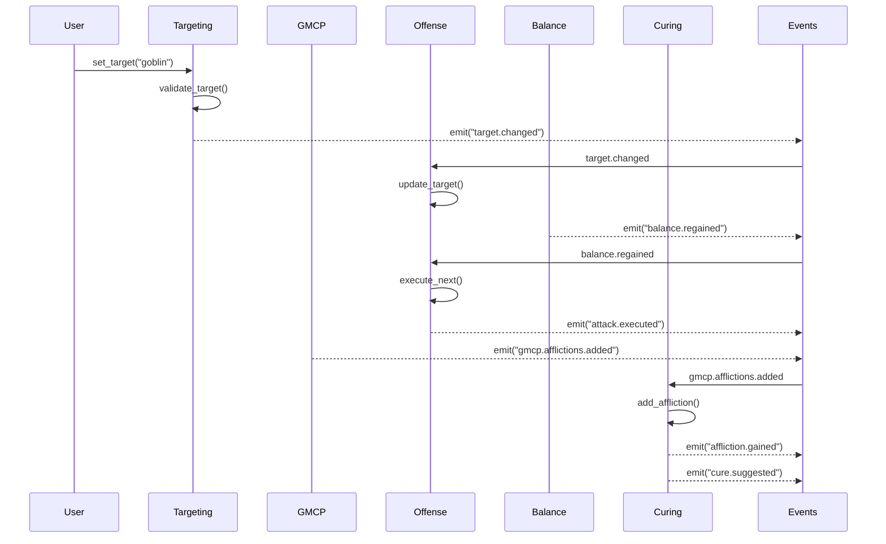
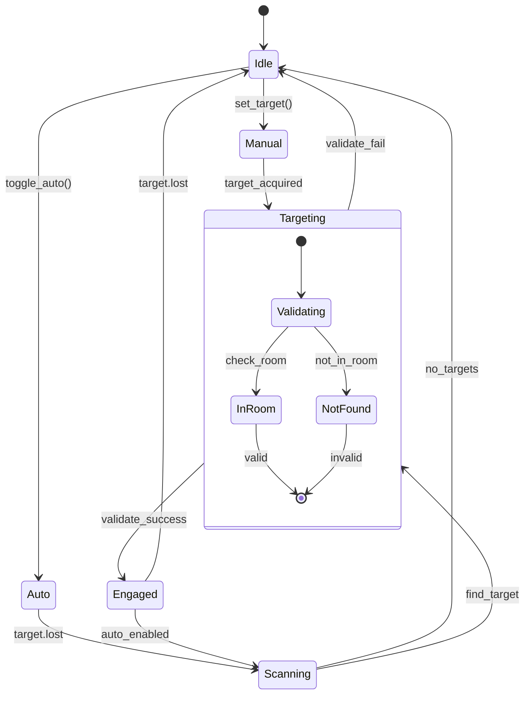
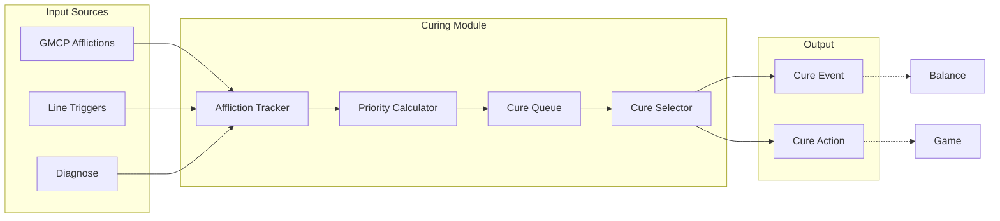

# EMERGE Development Workflow & Timeline

## Project Overview
EMERGE (Emergent Modular Engagement & Response Generation Engine) - Phase 2 Core Modules Development

**Target Completion**: Friday (4 days from now)
**Current Status**: Phase 1 Complete (Event system, State, Config, Utils, Help, GMCP, Balance)
**Goal**: Complete Phase 2 Core Modules (Targeting, Curing, Defense, Offense, Bashing)

## Development Timeline

### Day 1 (Tuesday) - Foundation & Targeting
**Morning (4 hours)**
- [ ] Analyze existing patterns and architecture (1 hour)
- [ ] Design and implement Targeting module (3 hours)
  - Core targeting logic
  - GMCP integration
  - Event handling
  - Priority system

**Afternoon (4 hours)**
- [ ] Complete Targeting module testing (1 hour)
- [ ] Design Curing module architecture (1 hour)
- [ ] Implement Curing module core (2 hours)

### Day 2 (Wednesday) - Curing & Defense
**Morning (4 hours)**
- [ ] Complete Curing module implementation (2 hours)
  - Affliction tracking
  - Cure prioritization
  - Event integration
- [ ] Test Curing module (1 hour)
- [ ] Design Defense module architecture (1 hour)

**Afternoon (4 hours)**
- [ ] Implement Defense module (3 hours)
  - Defense tracking
  - Auto-defense logic
  - Priority management
- [ ] Test Defense module (1 hour)

### Day 3 (Thursday) - Offense & Bashing
**Morning (4 hours)**
- [ ] Design Offense module architecture (1 hour)
- [ ] Implement Offense module (3 hours)
  - Attack queue system
  - Combo management
  - Target integration

**Afternoon (4 hours)**
- [ ] Design Bashing module architecture (1 hour)
- [ ] Implement Bashing module (3 hours)
  - Auto-attack logic
  - Area management
  - Safety features

### Day 4 (Friday) - Integration & Testing
**Morning (4 hours)**
- [ ] Complete integration testing (2 hours)
- [ ] Performance optimization (1 hour)
- [ ] Bug fixes and refinements (1 hour)

**Afternoon (4 hours)**
- [ ] Create comprehensive tests (2 hours)
- [ ] Documentation updates (1 hour)
- [ ] Final review and deployment (1 hour)

## Module Development Steps

### For Each Module:

#### 1. Architecture Design (1 hour)
- Define module purpose and scope
- Design event contracts (emitted/consumed)
- Plan state management structure
- Identify integration points
- Create API specification

#### 2. Implementation (2-3 hours)
- Create module file following standard pattern
- Implement init/shutdown functions
- Build core functionality
- Add event handlers
- Implement public API

#### 3. Testing (1 hour)
- Unit test core functions
- Integration test with events
- Performance validation
- Edge case handling
- Debug mode verification

#### 4. Documentation (30 minutes)
- Update module comments
- Add to help system
- Create usage examples
- Document event flows

## Detailed Module Specifications

### 1. Targeting Module (`modules/targeting.lua`)
**Purpose**: Manage combat targets with priority system
**Key Features**:
- Current target tracking
- Target list with priorities
- Auto-targeting modes (manual/auto/assist)
- GMCP target validation
- Target history tracking

**Core Functions**:
```lua
set_target(name)         -- Set current target
get_target()            -- Get current target
add_to_list(name, pri)  -- Add to target list
get_next_target()       -- Get highest priority
toggle_auto()           -- Toggle auto-targeting
```

**Events Emitted**:
- `target.changed` - Target switched
- `target.lost` - Target died/left
- `target.acquired` - New target set
- `target.list.updated` - List changed

**Events Consumed**:
- `gmcp.room.changed` - Validate targets
- `gmcp.status.changed` - GMCP target updates
- `combat.kill` - Remove dead targets

### 2. Curing Module (`modules/curing.lua`)
**Purpose**: Track afflictions and manage curing priorities
**Key Features**:
- Affliction tracking with sources
- Dynamic cure prioritization
- Cure balance management
- Diagnose integration
- Predictive curing

**Core Functions**:
```lua
add_affliction(name, source)    -- Track new affliction
cure_affliction(name)           -- Mark as cured
get_afflictions()               -- Get current afflictions
get_cure_priority()             -- Get next cure
set_priority(aff, priority)     -- Adjust priorities
```

**Events Emitted**:
- `affliction.gained` - New affliction
- `affliction.cured` - Affliction removed
- `cure.suggested` - Cure recommendation
- `diagnose.needed` - Should diagnose

**Events Consumed**:
- `gmcp.afflictions.added` - GMCP afflictions
- `gmcp.afflictions.removed` - GMCP cures
- `balance.changed` - Update cure timing

### 3. Defense Module (`modules/defense.lua`)
**Purpose**: Manage defensive abilities and keepup
**Key Features**:
- Defense tracking and upkeep
- Priority-based defense raising
- Resource management
- Situational defense logic
- Defense stripping alerts

**Core Functions**:
```lua
add_defense(name, command)      -- Register defense
remove_defense(name)            -- Mark defense down
check_defenses()                -- Verify all up
raise_defense(name)             -- Raise specific defense
set_keepup(name, enabled)       -- Toggle keepup
```

**Events Emitted**:
- `defense.gained` - Defense raised
- `defense.lost` - Defense stripped
- `defense.missing` - Need to raise
- `defense.command` - Execute defense command

**Events Consumed**:
- `gmcp.defenses.added` - GMCP defense up
- `gmcp.defenses.removed` - GMCP defense down
- `balance.regained` - Can raise defenses

### 4. Offense Module (`modules/offense.lua`)
**Purpose**: Coordinate attacks and combat combos
**Key Features**:
- Attack queue management
- Combo building and execution
- Limb tracking integration
- Venom selection logic
- Attack timing optimization

**Core Functions**:
```lua
queue_attack(action, target)    -- Queue an attack
execute_next()                  -- Run next attack
build_combo(attacks)            -- Create combo
set_strategy(name)              -- Change strategy
get_next_action()               -- Get recommended action
```

**Events Emitted**:
- `attack.queued` - Attack added to queue
- `attack.executed` - Attack sent
- `combo.built` - Combo prepared
- `strategy.changed` - New strategy set

**Events Consumed**:
- `balance.regained` - Can attack
- `target.changed` - Update attack target
- `affliction.gained` - Adjust strategy

### 5. Bashing Module (`modules/bashing.lua`)
**Purpose**: Automate PvE combat safely
**Key Features**:
- Auto-attack with battlerage
- Health/mana monitoring
- Flee conditions
- Area-specific configurations
- Loot tracking

**Core Functions**:
```lua
start_bashing()                 -- Enable bashing
stop_bashing()                  -- Disable bashing
set_attack(command)             -- Set attack command
set_threshold(type, value)      -- Set safety threshold
add_flee_trigger(condition)     -- Add flee condition
```

**Events Emitted**:
- `bashing.started` - Bashing enabled
- `bashing.stopped` - Bashing disabled
- `bashing.attacking` - Attack sent
- `bashing.fleeing` - Flee triggered

**Events Consumed**:
- `gmcp.vitals.changed` - Monitor health
- `target.lost` - Find new target
- `room.changed` - Check area config

## Architecture Diagrams

### System Overview


### Event Flow Example - Combat Sequence


### Module State Machine - Targeting


### Data Flow - Curing Priority


## Performance Requirements

### Critical Metrics
- Event processing: < 1ms per handler
- State updates: < 0.5ms per operation
- Module initialization: < 10ms per module
- Memory footprint: < 1MB per module
- Pattern matching: Anchored regex only

### Optimization Guidelines
1. **Pre-allocate tables** for frequently used data
2. **Reuse objects** instead of creating new ones
3. **Batch updates** to reduce event spam
4. **Cache calculations** that don't change often
5. **Use early returns** to avoid unnecessary processing

## Testing Strategy

### Unit Tests (Per Module)
```lua
-- test_<module>.lua structure
local tests = {}

function tests.test_init()
    -- Test module initialization
end

function tests.test_core_functions()
    -- Test each public function
end

function tests.test_event_handling()
    -- Test event emission/consumption
end

function tests.test_error_cases()
    -- Test error conditions
end

function tests.test_performance()
    -- Benchmark critical paths
end

return tests
```

### Integration Tests
1. **Module Loading Order** - Verify dependencies
2. **Event Flow** - End-to-end scenarios
3. **State Persistence** - Save/load cycles
4. **Performance Under Load** - Stress testing
5. **Error Recovery** - Failure scenarios

## Code Quality Standards

### Every Module Must:
1. Follow the standard module pattern
2. Include comprehensive documentation
3. Implement proper error handling
4. Support debug mode logging
5. Clean up resources on shutdown
6. Validate all inputs
7. Emit appropriate events
8. Handle missing dependencies gracefully

### Documentation Requirements
- Module header with purpose and version
- Function documentation with parameters/returns
- Event documentation with payload structure
- Usage examples in comments
- Performance notes where relevant

## Risk Mitigation

### Potential Risks
1. **Integration Complexity** - Mitigate with thorough event documentation
2. **Performance Degradation** - Continuous benchmarking during development
3. **State Corruption** - Defensive programming and validation
4. **Module Conflicts** - Clear namespace separation
5. **User Confusion** - Comprehensive help system integration

### Contingency Plans
- If a module isn't complete by deadline, ensure partial functionality works
- Core modules (Targeting, Curing) are highest priority
- Offense/Bashing can be simplified if needed
- Documentation can be finalized post-deadline

## Success Criteria

### Must Have (Friday)
- [x] All 5 modules loading without errors
- [x] Basic functionality for each module
- [x] Event integration working
- [x] No performance regressions
- [x] Core combat loop functional

### Should Have
- [ ] Comprehensive test coverage
- [ ] Full help system integration
- [ ] Advanced features (predictive curing, combo building)
- [ ] Performance optimizations

### Nice to Have
- [ ] UI integration started
- [ ] Class-specific hooks ready
- [ ] Advanced configuration options
- [ ] Usage analytics

## Daily Checkpoints

### End of Each Day
1. Run full test suite
2. Check performance metrics
3. Update progress tracking
4. Commit stable code
5. Plan next day priorities

### Communication
- Morning: Review plan and priorities
- Midday: Progress check and blockers
- Evening: Code review and testing
- End of day: Status summary

This workflow ensures systematic progress toward completing all Phase 2 modules by Friday while maintaining code quality and system stability.