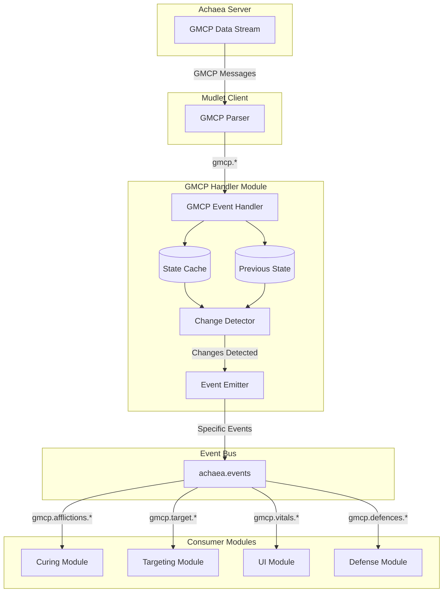
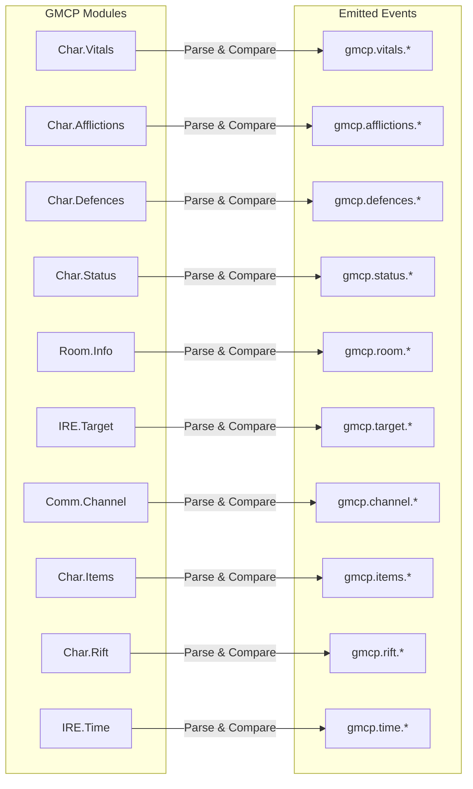
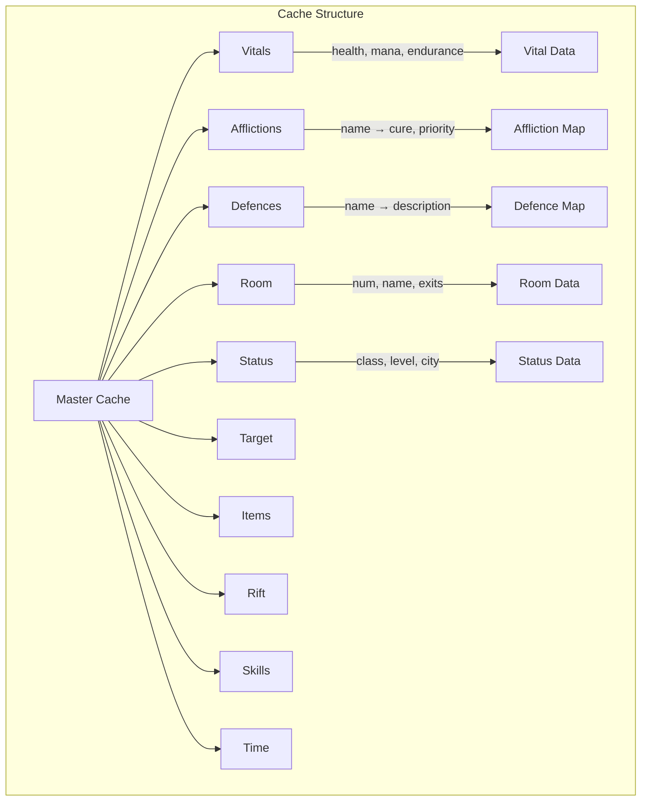
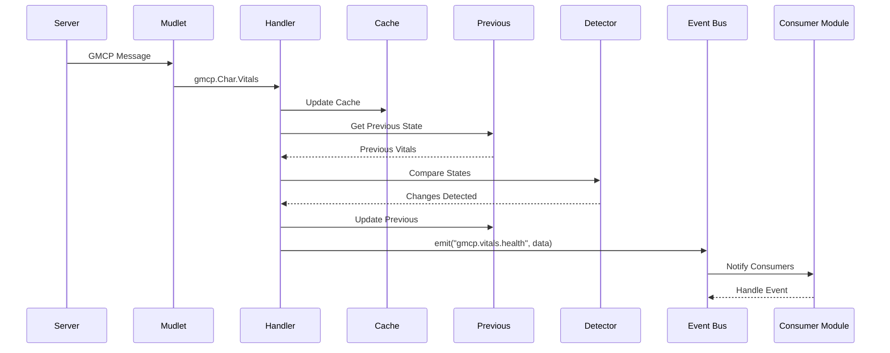
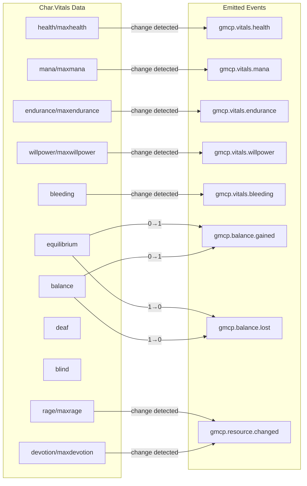
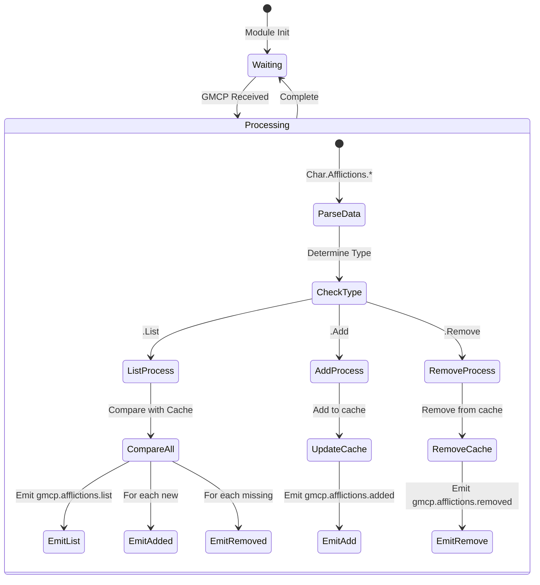
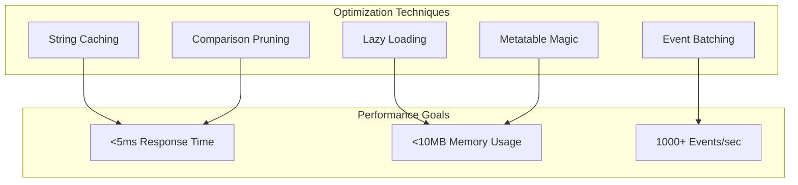
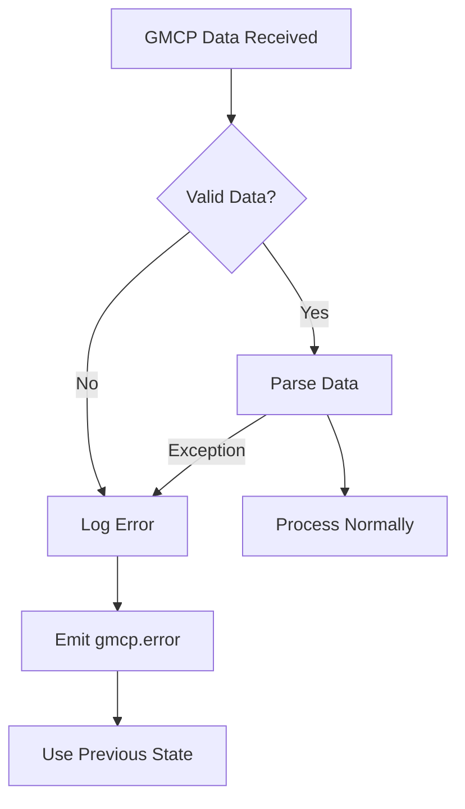

# GMCP Handler Module Design

## Overview

The GMCP handler is the critical bridge between Achaea's server data and EMERGE's event-driven architecture. It parses all GMCP messages, detects state changes, and emits granular events that other modules consume.

## Architecture Principles

1. **Zero Dependencies**: The GMCP handler depends only on the event system
2. **State Detection**: Compares previous and current states to detect changes
3. **Granular Events**: Emits specific events for each type of change
4. **Performance First**: Sub-5ms processing time for all GMCP messages
5. **Hot Reloadable**: Maintains state across reloads

## Data Flow Architecture



## GMCP Module Mapping



## Internal State Management



## Event Processing Pipeline



## Detailed Event Mappings

### Char.Vitals Events



### Affliction Processing



## Implementation Plan

### Phase 1: Core Structure
```lua
-- 1. Module skeleton with init/shutdown
-- 2. GMCP handler registration
-- 3. Basic cache structure
-- 4. Debug mode support
```

### Phase 2: Vital Processing
```lua
-- 1. Char.Vitals handler
-- 2. Change detection for all vitals
-- 3. Balance state tracking
-- 4. Resource tracking (rage, devotion, etc)
```

### Phase 3: Affliction System
```lua
-- 1. Affliction list/add/remove handlers
-- 2. Affliction cache with cure data
-- 3. Blackout/recklessness handling
-- 4. Affliction query API
```

### Phase 4: Defense System
```lua
-- 1. Defence list/add/remove handlers
-- 2. Defence cache management
-- 3. Defence query API
```

### Phase 5: Room & Movement
```lua
-- 1. Room.Info handler
-- 2. Room.Players handlers
-- 3. Movement detection
-- 4. Area tracking
```

### Phase 6: Extended GMCP
```lua
-- 1. IRE.Target handlers
-- 2. Comm.Channel handler
-- 3. Char.Items handlers
-- 4. Char.Rift handler
-- 5. IRE.Time handler
-- 6. Char.Skills handler
```

### Phase 7: Optimization
```lua
-- 1. Performance profiling
-- 2. Cache optimization
-- 3. Event batching
-- 4. Memory management
```

## Performance Optimization Strategies



## Error Handling Strategy



## Testing Strategy

### Unit Tests
1. Test each GMCP handler in isolation
2. Test change detection logic
3. Test cache operations
4. Test error handling

### Integration Tests
1. Test full GMCP message flow
2. Test event emission accuracy
3. Test performance under load
4. Test hot-reload functionality

### Performance Tests
1. Measure handler execution time
2. Measure memory usage
3. Test with rapid GMCP updates
4. Profile bottlenecks

## Module Interface

```lua
-- Public API Summary
achaea.gmcp = {
    -- Lifecycle
    init = function() end,
    shutdown = function() end,
    
    -- Configuration
    debug = function(enabled) end,
    
    -- Vital Queries
    getVital = function(name) end,
    getVitals = function() end,
    
    -- Affliction Queries
    getAffliction = function(name) end,
    getAfflictions = function() end,
    hasAffliction = function(name) end,
    
    -- Defence Queries
    getDefence = function(name) end,
    getDefences = function() end,
    hasDefence = function(name) end,
    
    -- Room Queries
    getRoom = function() end,
    
    -- Status Queries
    getStatus = function() end,
    isBlackout = function() end,
    isReckless = function() end,
    
    -- Target Queries
    getTarget = function() end,
    
    -- Item Queries
    getRift = function() end,
    getItems = function() end,
    
    -- Time Queries
    getTime = function() end,
    
    -- Skill Queries
    getSkills = function() end
}
```

## Example Usage Patterns

### Curing Module Integration
```lua
-- Listen for afflictions
achaea.events:on("gmcp.afflictions.added", function(data)
    local affliction = data.affliction
    local cure = data.cure
    local priority = data.priority
    
    if not achaea.gmcp.isBlackout() then
        achaea.events:emit("curing.queue.add", affliction, {
            cure = cure,
            priority = priority
        })
    end
end)
```

### UI Module Integration
```lua
-- Update health gauge
achaea.events:on("gmcp.vitals.health", function(data)
    local percent = data.percent
    local current = data.current
    local max = data.max
    
    updateHealthGauge(current, max)
    
    if percent < 30 then
        flashHealthWarning()
    end
end)
```

### Defense Module Integration
```lua
-- Track important defenses
local critical_defenses = {"rebounding", "shield", "prismatic"}

achaea.events:on("gmcp.defences.removed", function(data)
    local defence = data.defence
    
    if table.contains(critical_defenses, defence) then
        achaea.events:emit("defense.critical.lost", defence)
    end
end)
```

## Conclusion

The GMCP handler serves as the foundational data layer for the entire EMERGE combat system. By converting raw GMCP data into granular, semantic events, it enables all other modules to operate independently while maintaining perfect synchronization with the game state.

The design prioritizes:
- Performance (sub-5ms processing)
- Modularity (zero dependencies)
- Completeness (all GMCP modules)
- Reliability (error handling)
- Maintainability (clear structure)

This architecture ensures that EMERGE can respond to game events with minimal latency while maintaining clean separation of concerns across all modules.