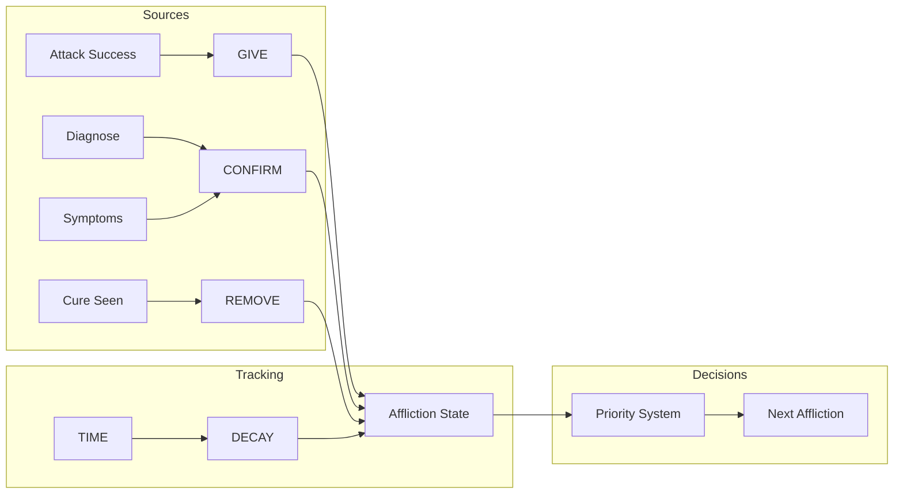

# EMERGE Affliction Tracking System Design

## The Core Problem

In combat, you need to know:
1. What afflictions the target currently has
2. What they've cured (and when)
3. What you should give next
4. How to adapt when they cure unexpectedly

## Traditional Approach Problems

Most systems track afflictions like this:
```lua
-- Simple boolean tracking (incorrect)
target.afflictions.paralysis = true  -- We THINK they have it
```

But this is often wrong because:
- Hidden cures (tree, passive curing, fitness)
- Illusions
- Failed attacks (rebounding, shield, dodge)
- Class-specific cures (shrugging, passive healing)

## EMERGE's Multi-Layer Tracking

### 1. Confidence-Based Tracking

Instead of boolean yes/no, we track confidence levels:

```lua
target.afflictions = {
    paralysis = {
        confidence = 0.95,      -- 95% sure they have it
        given_at = 1234567890,  -- When we gave it
        given_by = "dsl",       -- What ability gave it
        confirmed = false,      -- Have we seen symptoms?
        cure_possible = true,   -- Could they have cured it?
        decay_rate = 0.01       -- Confidence decay per second
    }
}
```

### 2. Four-State Model

Each affliction exists in one of four states:

```lua
AFFLICTION_STATES = {
    ABSENT = "absent",          -- We know they DON'T have it (default state)
    ASSUMED = "assumed",        -- We gave it, no cure seen (high confidence)
    POSSIBLE = "possible",      -- They might have cured it (low confidence)
    CONFIRMED = "confirmed"     -- We've seen proof (diagnose, symptoms)
}
```

This maps to confidence levels:
- **ABSENT**: 0% confidence (not tracked in affliction table)
- **POSSIBLE**: 1-49% confidence (probably cured)
- **ASSUMED**: 50-94% confidence (probably have it)
- **CONFIRMED**: 95-100% confidence (definitely have it)

### 3. Event-Driven Updates



### 4. Cure Detection & Inference

```lua
-- Direct cure detection
emerge.events:on("line.cure", function(line, cure_type)
    -- "Bob eats a piece of kelp"
    local possible_cures = CURE_TABLES[cure_type]
    if #possible_cures == 1 then
        -- Definite cure
        remove_affliction(target, possible_cures[1])
    else
        -- Multiple possibilities
        infer_cure(target, possible_cures)
    end
end)

-- Inference system
function infer_cure(target, possible_cures)
    -- Sort by what we think they'd prioritize
    local cure_priority = get_cure_priority(target.class)
    
    for _, aff in ipairs(cure_priority) do
        if target.afflictions[aff] and 
           table.contains(possible_cures, aff) then
            -- Most likely cure
            reduce_confidence(target, aff, 0.7)
            break
        end
    end
end
```

### 5. Priority System

Dynamic priority based on:
- Current afflictions (stacking)
- Class strategies
- Kill conditions
- Defensive needs

```lua
-- Priority calculation
function calculate_affliction_priority(target)
    local priorities = {}
    
    -- Base priorities
    for aff, data in pairs(AFFLICTION_DATA) do
        priorities[aff] = data.base_priority
    end
    
    -- Adjust for stacking
    if has_afflictions(target, {"asthma", "anorexia"}) then
        priorities.slickness = priorities.slickness + 20  -- Lock piece
    end
    
    -- Adjust for kill conditions
    if target.health_percent < 30 then
        priorities.sensitivity = priorities.sensitivity + 30
    end
    
    -- Adjust for what they can't cure
    if not target.afflictions.tree.ready then
        priorities.paralysis = priorities.paralysis + 10
    end
    
    return priorities
end
```

### 6. Hidden Cure Tracking

```lua
-- Track cure windows
target.cure_windows = {
    tree = {
        last_used = 0,
        cooldown = 10,
        ready = function() 
            return getEpoch() - last_used > cooldown 
        end
    },
    focus = {
        last_used = 0,
        cooldown = 2.5,
        ready = function()
            return getEpoch() - last_used > cooldown and
                   target.mana_percent > 15
        end
    }
}

-- Decay confidence when cure windows open
function update_cure_possibilities(target)
    -- Tree came off cooldown
    if target.cure_windows.tree.ready() then
        for aff, _ in pairs(TREE_CURES) do
            if target.afflictions[aff] then
                reduce_confidence(target, aff, 0.3)
            end
        end
    end
end
```

### 7. Smart Affliction Selection

```lua
function get_next_affliction(target)
    local candidates = {}
    
    -- Get all afflictions we could give
    for aff, methods in pairs(AFFLICTION_METHODS) do
        if can_deliver(aff, methods) then
            local score = calculate_score(target, aff)
            table.insert(candidates, {
                affliction = aff,
                score = score,
                method = methods[1]
            })
        end
    end
    
    -- Sort by score
    table.sort(candidates, function(a, b) 
        return a.score > b.score 
    end)
    
    return candidates[1]
end

function calculate_score(target, affliction)
    local score = 0
    
    -- Base priority
    score = AFFLICTION_DATA[affliction].priority
    
    -- Already have it? Lower score
    if target.afflictions[affliction] then
        score = score * (1 - target.afflictions[affliction].confidence)
    end
    
    -- Synergies
    for _, synergy in ipairs(AFFLICTION_SYNERGIES[affliction] or {}) do
        if target.afflictions[synergy.affliction] then
            score = score + synergy.bonus
        end
    end
    
    -- Defensive value
    if DEFENSIVE_AFFLICTIONS[affliction] and under_pressure() then
        score = score + 20
    end
    
    return score
end
```

## Integration Example

Here's how it all works together:

```lua
-- 1. We attack
emerge.events:on("combat.attack", function(ability, target)
    local afflictions = ABILITY_AFFLICTIONS[ability]
    for _, aff in ipairs(afflictions) do
        emerge.afflictions.give(target, aff, {
            confidence = 0.95,
            method = ability
        })
    end
end)

-- 2. Balance returns
emerge.events:on("balance.recovered", function()
    if not emerge.balance.all() then return end
    
    -- Get next affliction to give
    local next_aff = emerge.afflictions.get_next(current_target)
    
    -- Execute appropriate attack
    emerge.combat.execute(next_aff.method, next_aff.affliction)
end)

-- 3. They cure
emerge.events:on("cure.seen", function(target, cure_type)
    emerge.afflictions.handle_cure(target, cure_type)
end)

-- 4. Time passes (confidence decay)
tempTimer(1, function()
    emerge.afflictions.decay_all(current_target)
end, true) -- Repeating timer
```

## Key Design Principles

### 1. **Never Assume**
We never assume they have an affliction just because we tried to give it. We track confidence.

### 2. **Adaptive Priorities**
What to give next depends on:
- What they have
- What they can cure
- What advances our kill condition
- What protects us

### 3. **Fuzzy Logic**
Instead of "they have paralysis" (boolean), we think "we're 85% sure they have paralysis, decaying at 1% per second"

### 4. **Learn From Patterns**
Track their curing priorities to predict future cures:
```lua
-- Track cure choices
target.cure_patterns.kelp = {
    asthma = 0.7,      -- 70% of time they cure asthma first
    sensitivity = 0.2,  -- 20% sensitivity
    clumsiness = 0.1   -- 10% clumsiness
}
```

### 5. **State Verification**
Use every opportunity to verify state:
- Diagnose
- Symptom messages  
- Failed actions (paralysis stops movement)
- Successful actions (can't have paralysis if they moved)

## Advantages Over Traditional Systems

1. **Accuracy**: Confidence tracking is more realistic than boolean
2. **Adaptability**: Adjusts to their curing patterns
3. **Efficiency**: Doesn't waste attacks on afflictions they don't have
4. **Intelligence**: Makes smart choices based on game state
5. **Resilience**: Handles hidden cures and illusions gracefully

## Example Flow

```
1. DSL attack gives paralysis + asthma
   → paralysis: 95% confidence
   → asthma: 95% confidence

2. See "Bob eats kelp"
   → Check their usual priorities
   → asthma: 25% confidence (probably cured)
   → paralysis: 95% confidence (unchanged)

3. 2 seconds pass, no movement seen
   → paralysis: 93% confidence (decay)
   → Check tree window - it's open
   → paralysis: 65% confidence (might be tree cured)

4. Next balance: What to give?
   → Score paralysis: 30 (low, might have it)
   → Score impatience: 80 (high, lock piece)
   → Decision: Give impatience
```

This system ensures we're always making informed decisions based on probability rather than assumptions.