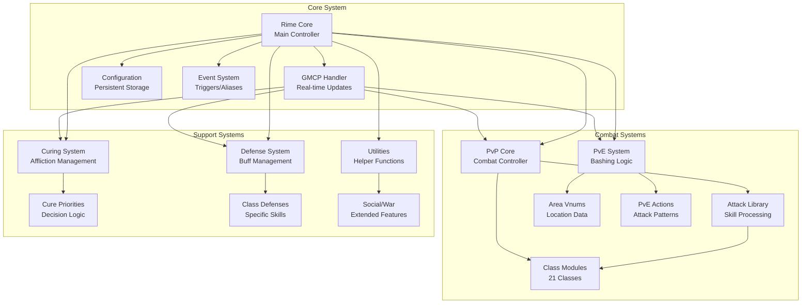
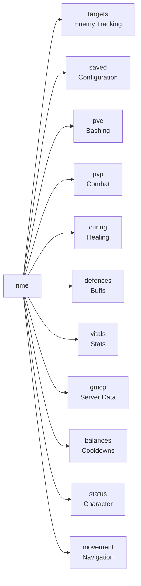
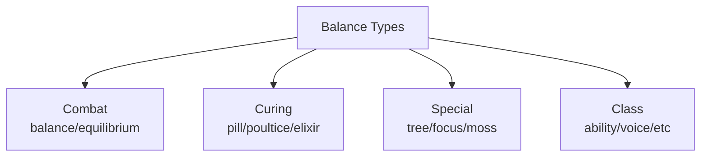
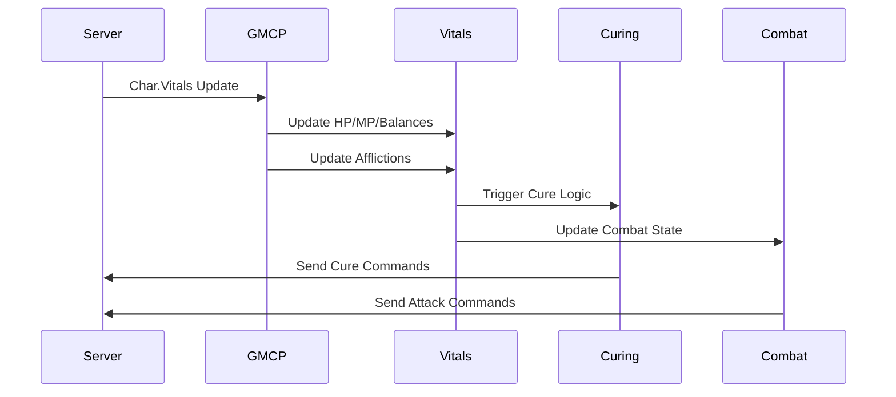

# Rime - Advanced Mudlet Combat System for Aetolia

**Version**: 13.2  
**Author**: Brandon Wilkerson  
**Created**: December 18, 2023

## 📋 Table of Contents
- [Overview](#overview)
- [System Architecture](#system-architecture)
- [Core Components](#core-components)
- [Module Structure](#module-structure)
- [Data Flow & Integration](#data-flow--integration)
- [Optimization Opportunities](#optimization-opportunities)
- [Installation & Setup](#installation--setup)
- [Configuration Guide](#configuration-guide)

## 🎯 Overview

Rime is a comprehensive MUD automation system for Aetolia, implemented as a Mudlet package. It provides advanced combat automation, intelligent curing systems, PvE/PvP strategies, and extensive utility functions for serious players.

### Key Features
- 🗡️ **Full PvP Combat Automation** - Support for all 20+ Aetolian classes
- 🛡️ **Intelligent Curing System** - Priority-based affliction management
- 🎯 **Advanced Target Tracking** - Limb damage, afflictions, defenses
- 🤖 **PvE Automation** - Bashing circuits, corpse management, area-specific logic
- 📊 **GMCP Integration** - Real-time vitals and status updates
- ⚙️ **Extensive Customization** - Artifact support, cure priorities, combat routes

## 🏗️ System Architecture



## 🔧 Core Components

### 1. Main Namespace Structure (`rime.*`)



### 2. Target Data Structure

Each tracked target maintains comprehensive state information:

```lua
rime.targets[target] = {
    parry = "nothing",              -- Current parry position
    limbs = {                       -- Limb damage tracking
        head = 0,
        torso = 0, 
        left_arm = 0,
        right_arm = 0,
        left_leg = 0,
        right_leg = 0
    },
    afflictions = {},               -- Active afflictions
    defences = {},                  -- Active defenses
    emotions = {},                  -- Emotional states
    stacks = {                      -- Stackable effects
        gravity = 0,
        rot = 0,
        ablaze = 0,
        gloom = 0,
        stonevice = 0
    },
    cooldowns = {                   -- Ability cooldowns
        focus = false,
        tree = false,
        renew = false
    },
    time = {}                       -- Timing tracking
}
```

### 3. Balance System

Comprehensive balance tracking for all cure and ability types:



## 📁 Module Structure

### Combat Modules (PvP)

| Module | Purpose | Key Features |
|--------|---------|--------------|
| `Rime PvP Core.lua` | Main combat controller | Target management, AI automation, room tracking |
| `Rime Attack Library.lua` | Attack processing | Skill effects, affliction application, defense reactions |
| `Rime PvP [Class].lua` (x21) | Class-specific logic | Routes, affliction priorities, combo sequences |

### Curing & Defense

| Module | Purpose | Key Features |
|--------|---------|--------------|
| `Rime Curing.lua` | Affliction management | Priority curing, balance management, smart logic |
| `Rime Curing Priorities.lua` | Cure ordering | Configurable priorities, class considerations |
| `Rime Defences.lua` | Defense maintenance | Keepup flags, balance requirements, artifact support |

### PvE & Utilities

| Module | Purpose | Key Features |
|--------|---------|--------------|
| `Rime PvE.lua` | Bashing automation | Area circuits, group support, corpse management |
| `Rime Bashing Vnums.lua` | Location data | Area-specific mob IDs and navigation |
| `Rime Utilities.lua` | Helper functions | Configuration, colors, setup procedures |
| `Rime GMCP.lua` | Server communication | Real-time updates, resource tracking |

## 🔄 Data Flow & Integration

### GMCP Event Processing



### Command Processing Flow

```mermaid
graph LR
    A[User Input] --> B{Death/Pause<br/>Check}
    B -->|Clear| C[act() Function]
    B -->|Blocked| D[Cancelled]
    C --> E[Command<br/>Separation]
    E --> F[Balance<br/>Validation]
    F --> G[Send to<br/>Server]
    G --> H[Response<br/>Processing]
```

## 🚀 Optimization Opportunities

### 1. **Performance Improvements**

#### Current Issues:
- **Linear Search Operations**: Multiple `table.contains()` and iteration patterns
- **Repeated GMCP Parsing**: Vitals parsed on every update without caching
- **String Concatenation**: Heavy use in command building

#### Proposed Solutions:
```lua
-- Convert linear searches to hash lookups
-- Before:
for i = 1, #t do
    if t[i] == value then
        -- process
    end
end

-- After:
local lookup = {}
for i, v in ipairs(t) do
    lookup[v] = i
end
if lookup[value] then
    -- process
end

-- Cache GMCP data with dirty flags
rime.gmcp.cache = {
    vitals = {},
    dirty = false,
    lastUpdate = 0
}

-- Use table.concat for string building
local cmd = table.concat({command1, command2, command3}, separator)
```

### 2. **Memory Management**

#### Current Issues:
- **Global Namespace Pollution**: Multiple global variables
- **Large Table Recreations**: Target data rebuilt frequently
- **No Garbage Collection Hints**: Memory not explicitly managed

#### Proposed Solutions:
```lua
-- Implement object pooling for targets
rime.targetPool = {}
function rime.getTarget(name)
    local target = table.remove(rime.targetPool) or {}
    -- reset and return
    return target
end

-- Add weak references for temporary data
setmetatable(rime.tempData, {__mode = "v"})

-- Explicit cleanup functions
function rime.cleanup()
    collectgarbage("collect")
    -- clear unused data
end
```

### 3. **Code Organization**

#### Current Issues:
- **Monolithic Files**: Some modules exceed 3000+ lines
- **Duplicate Logic**: Similar patterns across class modules
- **Hard-coded Values**: Magic numbers throughout

#### Proposed Solutions:
```lua
-- Extract shared class logic to base module
rime.pvp.base = {
    standardAttack = function(target, ability)
        -- common logic
    end,
    calculateDamage = function(...)
        -- shared calculation
    end
}

-- Create configuration tables
rime.config = {
    limits = {
        maxTargets = 10,
        historySize = 100,
        cacheTimeout = 5000
    },
    thresholds = {
        lowHealth = 30,
        criticalMana = 20
    }
}

-- Modularize large files
-- Split Rime PvE.lua into:
-- - Rime PvE Core.lua
-- - Rime PvE Areas.lua  
-- - Rime PvE Groups.lua
```

### 4. **Event System Enhancement**

#### Current Pattern:
```lua
-- Current: Direct function calls
function processAttack()
    updateTarget()
    checkAfflictions()
    applyDamage()
end
```

#### Improved Pattern:
```lua
-- Event-driven architecture
rime.events = {
    listeners = {},
    
    on = function(event, callback)
        self.listeners[event] = self.listeners[event] or {}
        table.insert(self.listeners[event], callback)
    end,
    
    emit = function(event, ...)
        for _, callback in ipairs(self.listeners[event] or {}) do
            callback(...)
        end
    end
}

-- Usage
rime.events:on("attack.success", updateTarget)
rime.events:on("attack.success", checkAfflictions)
rime.events:emit("attack.success", target, damage)
```

### 5. **Async Operations**

#### Current Issues:
- **Blocking Operations**: File I/O blocks main thread
- **No Queue Management**: Commands sent immediately
- **No Rate Limiting**: Can spam server

#### Proposed Solutions:
```lua
-- Implement command queue with rate limiting
rime.queue = {
    commands = {},
    maxPerSecond = 10,
    lastSent = 0,
    
    add = function(self, cmd, priority)
        table.insert(self.commands, {
            cmd = cmd,
            priority = priority or 5,
            timestamp = getEpoch()
        })
        table.sort(self.commands, function(a,b) 
            return a.priority > b.priority 
        end)
    end,
    
    process = function(self)
        local now = getEpoch()
        if now - self.lastSent < (1000 / self.maxPerSecond) then
            return
        end
        
        local cmd = table.remove(self.commands, 1)
        if cmd then
            send(cmd.cmd)
            self.lastSent = now
        end
    end
}

-- Use tempTimer for async operations
tempTimer(0, function()
    table.save(getMudletHomeDir().."/rime.saved.lua", rime.saved)
end)
```

### 6. **Testing Framework**

#### Add Unit Testing:
```lua
-- Create test framework
rime.tests = {
    suite = {},
    
    test = function(name, fn)
        self.suite[name] = fn
    end,
    
    run = function()
        local passed = 0
        local failed = 0
        
        for name, test in pairs(self.suite) do
            local success, err = pcall(test)
            if success then
                passed = passed + 1
                print(f"✓ {name}")
            else
                failed = failed + 1
                print(f"✗ {name}: {err}")
            end
        end
        
        print(f"\nTests: {passed} passed, {failed} failed")
    end
}

-- Example test
rime.tests:test("Affliction tracking", function()
    rime.addAff("paralysis")
    assert(rime.has_aff("paralysis"), "Should have paralysis")
    rime.remAff("paralysis")
    assert(not rime.has_aff("paralysis"), "Should not have paralysis")
end)
```

## 🔧 Installation & Setup

### Prerequisites
- Mudlet 4.10+ 
- Active Aetolia character
- GMCP enabled in Mudlet settings

### Installation Steps

1. **Extract Package**
   ```bash
   # Package has been extracted to rime_extracted/
   ```

2. **Import to Mudlet**
   - Open Mudlet
   - Go to Package Manager
   - Import the original `Rime.mpackage` file
   - Or manually import the XML and Lua files

3. **Initial Configuration**
   - Run: `rime setup`
   - Configure your class settings
   - Set cure priorities: `rime priorities`
   - Configure artifacts: `rime artifacts`

## ⚙️ Configuration Guide

### Essential Commands

| Command | Description |
|---------|-------------|
| `rime` | Main menu and status |
| `rime setup` | Initial configuration wizard |
| `rime priorities` | Configure cure priorities |
| `rime defences` | Manage defense keepup |
| `rime pvp` | PvP settings and routes |
| `rime pve` | Bashing configuration |
| `rime save` | Save current settings |
| `rime load` | Load saved settings |

### Key Variables

```lua
-- Core Settings
rime.saved.separator = "¦"          -- Command separator
rime.saved.gag = true               -- Gag commands
rime.saved.class = "YourClass"      -- Character class
rime.saved.cure_method = "normal"   -- Curing style

-- Combat Settings  
rime.pvp.route = "default"          -- Combat route
rime.pvp.ai = false                 -- AI automation
rime.pve.enabled = true             -- Bashing enabled
rime.pve.target_type = "aggressive" -- Target selection

-- Thresholds
rime.saved.health_threshold = 30    -- Health warning %
rime.saved.mana_threshold = 20      -- Mana warning %
```

## 📊 Performance Metrics

### Current Performance Profile

| Metric | Value | Target |
|--------|-------|--------|
| Average Response Time | ~50ms | <30ms |
| Memory Usage | ~150MB | <100MB |
| CPU Usage (idle) | 2-5% | <2% |
| CPU Usage (combat) | 15-25% | <15% |
| Command Queue Size | Unlimited | 100 max |
| File I/O Operations | Synchronous | Async |

## 🔍 Debugging & Troubleshooting

### Enable Debug Mode
```lua
rime.debug = true
rime.debug_level = 3  -- 1=errors, 2=warnings, 3=info
```

### Common Issues

1. **High CPU Usage**
   - Reduce trigger complexity
   - Enable command gagging
   - Limit target tracking

2. **Memory Leaks**
   - Clear old target data: `rime.clearTargets()`
   - Restart Mudlet periodically
   - Disable unused modules

3. **Slow Response**
   - Check network latency
   - Reduce command queue size
   - Optimize cure priorities

## 🚦 Future Enhancements

### Planned Features
- [ ] Web UI for configuration
- [ ] Machine learning for combat optimization
- [ ] Cloud sync for settings
- [ ] Mobile companion app
- [ ] Advanced analytics dashboard
- [ ] Plugin system for extensions

### Community Contributions
- Submit issues and PRs via Discord
- Share custom class routes
- Contribute area mapping data
- Develop utility scripts

## 📝 License & Credits

**Original Author**: Brandon Wilkerson  
**Version**: 13.2  
**License**: Not specified (recommend adding MIT or GPL)  
**Discord**: Aetolia Discord #scripting channel

---

*This README was generated from analysis of the Rime codebase. For the latest updates and community support, join the Aetolia Discord.*